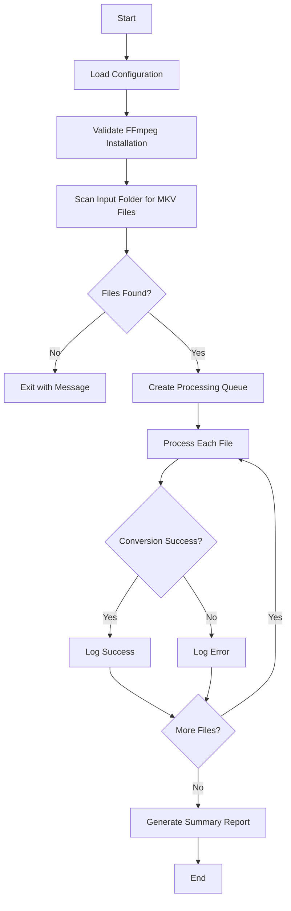

# 🎬 Project Plan: Batch Convert MKV → MP4 (480p) with Hard-Sub

**Project Goal**: Create a Python-based batch conversion tool to convert MKV files to 480p MP4 with hard-coded subtitles using FFmpeg.

---

## 📋 Table of Contents

1. [Project Structure](#1-project-structure)
2. [Requirements](#2-requirements)
3. [Workflow Overview](#3-workflow-overview)
4. [Function-Level Design](#4-function-level-design)
5. [Configuration](#5-configuration)
6. [Error Handling & Logging](#6-error-handling--logging)
7. [Optional Features](#7-optional-features)
8. [Implementation Timeline](#8-implementation-timeline)
9. [Testing Strategy](#9-testing-strategy)
10. [Expected Output](#10-expected-output)

---

## 1. Project Structure

```
mkv-mp4-with-hardsub/
│
├── input/              # Source MKV files (not tracked in git)
├── output/             # Converted MP4 files (not tracked in git)
├── logs/               # Processing logs
│   ├── success.log     # Successful conversions
│   ├── errors.log      # Failed conversions
│   └── summary.log     # Overall statistics
│
├── src/                # Source code
│   ├── __init__.py
│   ├── converter.py    # Core conversion logic
│   ├── config.py       # Configuration management
│   ├── logger.py       # Logging utilities
│   └── utils.py        # Helper functions
│
├── tests/              # Unit tests
│   ├── test_converter.py
│   ├── test_config.py
│   └── test_utils.py
│
├── config.yaml         # User configuration
├── main.py             # Entry point
├── pyproject.toml      # Dependencies (uv)
├── README.md           # User documentation
├── .gitignore          # Exclude input/output folders
└── docs/
    └── plans/
        └── project-plan.md  # This file
```

---

## 2. Requirements

### 2.1 System Requirements

- **FFmpeg**: Must be installed and accessible in PATH
- **Python**: 3.10 or higher
- **Disk Space**: Sufficient for input and output files
- **CPU**: Multi-core recommended for parallel processing

### 2.2 Python Dependencies

```toml
# pyproject.toml dependencies
[project.dependencies]
ffmpeg-python = "^0.2.0"
pyyaml = "^6.0"
tqdm = "^4.66.0"
pydantic = "^2.0"          # For configuration validation
pydantic-settings = "^2.0"  # For settings management
loguru = "^0.7.0"          # Modern logging library
```

### 2.3 Development Dependencies

```toml
[project.optional-dependencies]
dev = [
    "pytest>=7.4.0",
    "pytest-asyncio>=0.21.0",
    "ruff>=0.1.0",
    "mypy>=1.7.0",
]
```

---

## 3. Workflow Overview

### 3.1 High-Level Process Flow



### 3.2 Detailed Workflow Steps

#### Step 1: Load Configuration

**Purpose**: Read and validate user settings from `config.yaml`

**Tasks**:
- Load YAML configuration file
- Validate settings using Pydantic models
- Set default values for missing options
- Create output/logs directories if they don't exist

**Output**: Validated configuration object

---

#### Step 2: Validate FFmpeg Installation

**Purpose**: Ensure FFmpeg is available before processing

**Tasks**:
- Check if FFmpeg is in system PATH
- Verify FFmpeg version and capabilities
- Test FFmpeg can be executed

**Error Handling**: Exit gracefully if FFmpeg not found

---

#### Step 3: Scan for MKV Files

**Purpose**: Discover all MKV files to be processed

**Tasks**:
- Recursively search input directory for `.mkv` files
- Filter out hidden files and system files
- Sort files alphabetically for consistent processing
- Create processing job list

**Output**: List of file paths to process

---

#### Step 4: Process Each MKV File

**Sub-steps**:

##### 4.1 Extract Metadata (Optional)
- Detect video codec, resolution, bitrate
- Identify subtitle tracks (language, format)
- Log original file size and duration

##### 4.2 Generate Output Filename
- Extract base filename without extension
- Add `_480p` suffix
- Ensure unique filename (avoid overwrites)

**Example**:
```
Input:  input/movies/avatar.mkv
Output: output/movies/avatar_480p.mp4
```

##### 4.3 Construct FFmpeg Command

**FFmpeg Command Structure**:
```bash
ffmpeg -i input.mkv \
    -vf "subtitles=input.mkv,scale=-2:480" \
    -vcodec libx264 \
    -acodec aac \
    -crf 24 \
    -preset medium \
    -movflags +faststart \
    output.mp4
```

**Parameters Explained**:
- `-vf "subtitles=input.mkv"`: Burn subtitles into video (hard-sub)
- `scale=-2:480`: Resize to 480p, maintain aspect ratio
- `-vcodec libx264`: Encode video with H.264
- `-acodec aac`: Encode audio to AAC
- `-crf 24`: Constant Rate Factor (quality: 0-51, lower = better)
- `-preset medium`: Encoding speed (ultrafast to veryslow)
- `-movflags +faststart`: Optimize for web streaming

##### 4.4 Execute Conversion
- Run FFmpeg via `ffmpeg-python` or `subprocess`
- Display progress bar using `tqdm`
- Capture stdout/stderr for logging
- Monitor conversion time

##### 4.5 Validate Output
- Check if output file exists
- Verify file size > 0
- Optional: Validate video integrity using FFprobe

##### 4.6 Error Handling
- Catch FFmpeg errors
- Log error details (filename, error message, timestamp)
- Continue processing next file
- Optionally: Move failed input files to error folder

---

#### Step 5: Logging

**Log Format**:
```
[2025-12-05 10:30:45] SUCCESS | avatar.mkv → avatar_480p.mp4 | 1.2GB → 450MB | 2m 34s
[2025-12-05 10:33:20] ERROR   | broken.mkv → Failed | Error: Invalid data found
```

**Log Categories**:
- **Success Log**: All successful conversions
- **Error Log**: Failed conversions with error details
- **Summary Log**: Overall statistics and report

---

#### Step 6: Generate Summary Report

**Report Contents**:
```
========================================
     CONVERSION SUMMARY REPORT
========================================

Total Files Processed:  15
✅ Successful:          13
❌ Failed:              2
⏱️  Total Time:         45m 20s

Original Total Size:    18.5 GB
Converted Total Size:   6.2 GB
Space Saved:            12.3 GB (66%)

Failed Files:
  1. broken.mkv - Error: Invalid data found
  2. corrupted.mkv - Error: Encoder timeout

========================================
```

---

## 4. Function-Level Design

### 4.1 Main Entry Point

**File**: `main.py`

```python
from pathlib import Path
from src.config import load_config, Config
from src.converter import BatchConverter
from src.logger import setup_logging
from src.utils import validate_ffmpeg
from loguru import logger

def main() -> None:
    """Main entry point for batch conversion."""
    # Setup logging
    setup_logging()
    
    # Load and validate configuration
    config: Config = load_config("config.yaml")
    logger.info("Configuration loaded successfully")
    
    # Validate FFmpeg installation
    if not validate_ffmpeg():
        logger.error("FFmpeg not found in PATH")
        return
    
    # Initialize batch converter
    converter = BatchConverter(config=config)
    
    # Scan for MKV files
    mkv_files: list[Path] = converter.scan_input_folder()
    
    if not mkv_files:
        logger.info("No MKV files found in input folder")
        return
    
    logger.info(f"Found {len(mkv_files)} MKV file(s) to process")
    
    # Process all files
    results = converter.process_all(mkv_files)
    
    # Generate summary report
    converter.generate_summary(results)

if __name__ == "__main__":
    main()
```

---

### 4.2 Core Modules

#### Module: `src/config.py`

**Purpose**: Configuration management with validation

```python
from pathlib import Path
from typing import Optional
from pydantic import BaseModel, Field, field_validator
from pydantic_settings import BaseSettings
import yaml

class VideoConfig(BaseModel):
    """Video encoding settings."""
    resolution: int = Field(default=480, description="Target height in pixels")
    codec: str = Field(default="libx264", description="Video codec")
    crf: int = Field(default=24, ge=0, le=51, description="Constant Rate Factor")
    preset: str = Field(default="medium", description="Encoding preset")
    
    @field_validator("preset")
    @classmethod
    def validate_preset(cls, v: str) -> str:
        """Validate FFmpeg preset."""
        valid_presets = ["ultrafast", "superfast", "veryfast", "faster", 
                        "fast", "medium", "slow", "slower", "veryslow"]
        if v not in valid_presets:
            raise ValueError(f"Invalid preset. Choose from: {valid_presets}")
        return v

class AudioConfig(BaseModel):
    """Audio encoding settings."""
    codec: str = Field(default="aac", description="Audio codec")
    bitrate: str = Field(default="128k", description="Audio bitrate")

class Config(BaseSettings):
    """Main configuration model."""
    input_folder: Path = Field(default=Path("input"))
    output_folder: Path = Field(default=Path("output"))
    logs_folder: Path = Field(default=Path("logs"))
    
    video: VideoConfig = Field(default_factory=VideoConfig)
    audio: AudioConfig = Field(default_factory=AudioConfig)
    
    # Optional features
    parallel_processing: bool = Field(default=False)
    max_workers: int = Field(default=2, ge=1, le=8)
    skip_existing: bool = Field(default=True)
    
    class Config:
        """Pydantic configuration."""
        env_file = ".env"
        env_prefix = "CONVERTER_"

def load_config(config_path: str = "config.yaml") -> Config:
    """Load and validate configuration from YAML file."""
    config_file = Path(config_path)
    
    if config_file.exists():
        with open(config_file, "r") as f:
            config_data = yaml.safe_load(f)
        return Config(**config_data)
    else:
        # Return default configuration
        return Config()
```

---

#### Module: `src/converter.py`

**Purpose**: Core conversion logic

```python
from pathlib import Path
from typing import Any
import subprocess
from dataclasses import dataclass
from datetime import datetime
from loguru import logger

from src.config import Config

@dataclass
class ConversionResult:
    """Result of a single file conversion."""
    input_file: Path
    output_file: Path
    success: bool
    duration_seconds: float
    original_size_mb: float
    converted_size_mb: float
    error_message: str | None = None

class BatchConverter:
    """Batch MKV to MP4 converter with hard-sub."""
    
    def __init__(self, config: Config) -> None:
        """Initialize batch converter."""
        self.config: Config = config
        self._ensure_directories()
    
    def _ensure_directories(self) -> None:
        """Create output and logs directories if they don't exist."""
        self.config.output_folder.mkdir(parents=True, exist_ok=True)
        self.config.logs_folder.mkdir(parents=True, exist_ok=True)
    
    def scan_input_folder(self) -> list[Path]:
        """Scan input folder for MKV files."""
        input_path: Path = self.config.input_folder
        
        if not input_path.exists():
            logger.error(f"Input folder not found: {input_path}")
            return []
        
        mkv_files: list[Path] = sorted(input_path.glob("**/*.mkv"))
        return mkv_files
    
    def _generate_output_path(self, input_file: Path) -> Path:
        """Generate output filename with _480p suffix."""
        relative_path: Path = input_file.relative_to(self.config.input_folder)
        output_name: str = f"{input_file.stem}_480p.mp4"
        output_path: Path = self.config.output_folder / relative_path.parent / output_name
        
        # Create subdirectories if needed
        output_path.parent.mkdir(parents=True, exist_ok=True)
        
        return output_path
    
    def _build_ffmpeg_command(self, input_file: Path, output_file: Path) -> list[str]:
        """Construct FFmpeg command for conversion."""
        cmd: list[str] = [
            "ffmpeg",
            "-i", str(input_file),
            "-vf", f"subtitles={input_file},scale=-2:{self.config.video.resolution}",
            "-vcodec", self.config.video.codec,
            "-acodec", self.config.audio.codec,
            "-crf", str(self.config.video.crf),
            "-preset", self.config.video.preset,
            "-b:a", self.config.audio.bitrate,
            "-movflags", "+faststart",
            "-y",  # Overwrite output file if exists
            str(output_file)
        ]
        return cmd
    
    def process_file(self, input_file: Path) -> ConversionResult:
        """Process a single MKV file."""
        start_time: datetime = datetime.now()
        output_file: Path = self._generate_output_path(input_file)
        
        # Skip if output already exists and skip_existing is True
        if self.config.skip_existing and output_file.exists():
            logger.info(f"Skipping {input_file.name} (already converted)")
            return ConversionResult(
                input_file=input_file,
                output_file=output_file,
                success=True,
                duration_seconds=0,
                original_size_mb=0,
                converted_size_mb=output_file.stat().st_size / (1024 * 1024),
            )
        
        try:
            # Get original file size
            original_size_mb: float = input_file.stat().st_size / (1024 * 1024)
            
            # Build FFmpeg command
            cmd: list[str] = self._build_ffmpeg_command(input_file, output_file)
            
            logger.info(f"Converting: {input_file.name}")
            
            # Execute FFmpeg
            result = subprocess.run(
                cmd,
                capture_output=True,
                text=True,
                check=True
            )
            
            # Calculate duration
            duration: float = (datetime.now() - start_time).total_seconds()
            
            # Validate output
            if not output_file.exists() or output_file.stat().st_size == 0:
                raise ValueError("Output file is missing or empty")
            
            converted_size_mb: float = output_file.stat().st_size / (1024 * 1024)
            
            # Log success with extra context
            logger.success(
                f"{input_file.name} → {output_file.name} | "
                f"{original_size_mb:.1f}MB → {converted_size_mb:.1f}MB | "
                f"{duration:.1f}s"
            )
            
            return ConversionResult(
                input_file=input_file,
                output_file=output_file,
                success=True,
                duration_seconds=duration,
                original_size_mb=original_size_mb,
                converted_size_mb=converted_size_mb,
            )
            
        except subprocess.CalledProcessError as e:
            logger.error(f"FFmpeg error for {input_file.name}: {e.stderr}")
            return ConversionResult(
                input_file=input_file,
                output_file=output_file,
                success=False,
                duration_seconds=(datetime.now() - start_time).total_seconds(),
                original_size_mb=input_file.stat().st_size / (1024 * 1024),
                converted_size_mb=0,
                error_message=str(e.stderr)
            )
        except Exception as e:
            logger.exception(f"Unexpected error for {input_file.name}")
            return ConversionResult(
                input_file=input_file,
                output_file=output_file,
                success=False,
                duration_seconds=(datetime.now() - start_time).total_seconds(),
                original_size_mb=input_file.stat().st_size / (1024 * 1024),
                converted_size_mb=0,
                error_message=str(e)
            )
    
    def process_all(self, mkv_files: list[Path]) -> list[ConversionResult]:
        """Process all MKV files."""
        results: list[ConversionResult] = []
        
        for mkv_file in mkv_files:
            result: ConversionResult = self.process_file(mkv_file)
            results.append(result)
        
        return results
    
    def generate_summary(self, results: list[ConversionResult]) -> None:
        """Generate and display summary report."""
        total_files: int = len(results)
        successful: int = sum(1 for r in results if r.success)
        failed: int = total_files - successful
        
        total_original_size: float = sum(r.original_size_mb for r in results)
        total_converted_size: float = sum(r.converted_size_mb for r in results)
        space_saved: float = total_original_size - total_converted_size
        space_saved_percent: float = (space_saved / total_original_size * 100) if total_original_size > 0 else 0
        
        total_time: float = sum(r.duration_seconds for r in results)
        
        # Print summary
        print("\n" + "="*50)
        print("     CONVERSION SUMMARY REPORT")
        print("="*50)
        print(f"\nTotal Files Processed:  {total_files}")
        print(f"✅ Successful:          {successful}")
        print(f"❌ Failed:              {failed}")
        print(f"⏱️  Total Time:         {self._format_duration(total_time)}")
        print(f"\nOriginal Total Size:    {total_original_size:.2f} MB")
        print(f"Converted Total Size:   {total_converted_size:.2f} MB")
        print(f"Space Saved:            {space_saved:.2f} MB ({space_saved_percent:.1f}%)")
        
        if failed > 0:
            print("\nFailed Files:")
            for i, result in enumerate([r for r in results if not r.success], 1):
                print(f"  {i}. {result.input_file.name} - {result.error_message}")
        
        print("="*50 + "\n")
    
    @staticmethod
    def _format_duration(seconds: float) -> str:
        """Format duration in human-readable format."""
        mins, secs = divmod(int(seconds), 60)
        hours, mins = divmod(mins, 60)
        
        if hours > 0:
            return f"{hours}h {mins}m {secs}s"
        elif mins > 0:
            return f"{mins}m {secs}s"
        else:
            return f"{secs}s"
```

---

#### Module: `src/logger.py`

**Purpose**: Logging configuration and utilities using Loguru

```python
from pathlib import Path
from datetime import datetime
from loguru import logger
import sys

def setup_logging(logs_folder: Path = Path("logs"), verbose: bool = False) -> None:
    """Setup Loguru logging configuration.
    
    Args:
        logs_folder: Directory to store log files
        verbose: Enable debug level logging
    """
    logs_folder.mkdir(parents=True, exist_ok=True)
    
    # Remove default handler
    logger.remove()
    
    # Console handler with color and formatting
    log_level: str = "DEBUG" if verbose else "INFO"
    logger.add(
        sys.stderr,
        format="<green>{time:HH:mm:ss}</green> | <level>{level: <8}</level> | <level>{message}</level>",
        level=log_level,
        colorize=True,
    )
    
    # File handler - all logs with rotation
    logger.add(
        logs_folder / "conversion_{time:YYYY-MM-DD}.log",
        format="{time:YYYY-MM-DD HH:mm:ss} | {level: <8} | {message}",
        level="DEBUG",
        rotation="00:00",  # New file at midnight
        retention="30 days",  # Keep logs for 30 days
        compression="zip",  # Compress rotated logs
    )
    
    # Success log - only successful conversions
    logger.add(
        logs_folder / "success.log",
        format="{time:YYYY-MM-DD HH:mm:ss} | {message}",
        level="SUCCESS",
        filter=lambda record: record["level"].name == "SUCCESS",
    )
    
    # Error log - only errors
    logger.add(
        logs_folder / "errors.log",
        format="{time:YYYY-MM-DD HH:mm:ss} | {level} | {message}",
        level="ERROR",
        backtrace=True,  # Include full traceback
        diagnose=True,   # Show variable values
    )
    
    logger.info("Logging initialized successfully")

def get_logger():
    """Get the configured logger instance."""
    return logger
```

---

#### Module: `src/utils.py`

**Purpose**: Helper utilities

```python
import subprocess
from pathlib import Path

def validate_ffmpeg() -> bool:
    """Check if FFmpeg is installed and accessible."""
    try:
        result = subprocess.run(
            ["ffmpeg", "-version"],
            capture_output=True,
            text=True,
            check=True
        )
        return True
    except (subprocess.CalledProcessError, FileNotFoundError):
        return False

def get_video_info(video_path: Path) -> dict[str, str]:
    """Extract video metadata using ffprobe."""
    try:
        cmd: list[str] = [
            "ffprobe",
            "-v", "error",
            "-select_streams", "v:0",
            "-show_entries", "stream=width,height,codec_name,duration",
            "-of", "default=noprint_wrappers=1",
            str(video_path)
        ]
        
        result = subprocess.run(cmd, capture_output=True, text=True, check=True)
        
        # Parse output
        info: dict[str, str] = {}
        for line in result.stdout.split("\n"):
            if "=" in line:
                key, value = line.split("=", 1)
                info[key] = value
        
        return info
    except Exception:
        return {}
```

---

## 5. Configuration

### 5.1 config.yaml Template

```yaml
# Input/Output Directories
input_folder: "input"
output_folder: "output"
logs_folder: "logs"

# Video Encoding Settings
video:
  resolution: 480          # Target height (480p, 720p, 1080p)
  codec: "libx264"         # Video codec (libx264, libx265)
  crf: 24                  # Quality (0-51, lower = better quality)
  preset: "medium"         # Speed preset (ultrafast to veryslow)

# Audio Encoding Settings
audio:
  codec: "aac"             # Audio codec
  bitrate: "128k"          # Audio bitrate

# Processing Options
parallel_processing: false  # Enable parallel conversions
max_workers: 2             # Number of parallel workers
skip_existing: true        # Skip already converted files
```

---

## 6. Error Handling & Logging

### 6.1 Error Categories

| Error Type | Handling Strategy | User Impact |
|------------|------------------|-------------|
| **FFmpeg Not Found** | Exit with clear error message | Must install FFmpeg |
| **Invalid Config** | Use default values + warning | Continue with defaults |
| **Missing Input Folder** | Create folder + warning | Auto-create directory |
| **Corrupted MKV File** | Log error, skip file | Continue processing others |
| **FFmpeg Conversion Error** | Log details, continue | Skip failed file |
| **Disk Space Full** | Stop processing, alert user | Manual intervention needed |
| **Permission Denied** | Log error, skip file | Check file permissions |

### 6.2 Loguru Logging Levels

- **DEBUG**: Detailed diagnostic information (enabled with verbose flag)
- **INFO**: Normal operations (file processing, progress)
- **SUCCESS**: Successful conversions (Loguru custom level)
- **WARNING**: Recoverable issues (missing config, skip existing)
- **ERROR**: Failed conversions with traceback
- **CRITICAL**: Fatal errors that stop execution

**Loguru Benefits**:
- ✅ Automatic exception catching with `.exception()`
- ✅ Colored console output for better readability
- ✅ Automatic log rotation and compression
- ✅ Structured logging with context binding
- ✅ No handler configuration needed
- ✅ Thread-safe by default

---

## 7. Optional Features

### 7.1 Parallel Processing

**Implementation**: Use `concurrent.futures.ProcessPoolExecutor`

```python
from concurrent.futures import ProcessPoolExecutor, as_completed

def process_all_parallel(self, mkv_files: list[Path]) -> list[ConversionResult]:
    """Process files in parallel."""
    results: list[ConversionResult] = []
    
    with ProcessPoolExecutor(max_workers=self.config.max_workers) as executor:
        futures = {
            executor.submit(self.process_file, mkv_file): mkv_file 
            for mkv_file in mkv_files
        }
        
        for future in as_completed(futures):
            result: ConversionResult = future.result()
            results.append(result)
    
    return results
```

**Benefits**:
- Faster processing for multiple files
- Utilizes multi-core CPUs

**Considerations**:
- Higher CPU/memory usage
- May cause thermal throttling on laptops

---

### 7.2 Auto-Detect Subtitle Language

**Purpose**: Select specific subtitle track based on language preference

```python
from loguru import logger

def detect_subtitle_tracks(video_path: Path) -> list[dict[str, str]]:
    """Extract subtitle track information."""
    cmd: list[str] = [
        "ffprobe",
        "-v", "error",
        "-select_streams", "s",
        "-show_entries", "stream=index,codec_name:stream_tags=language",
        "-of", "json",
        str(video_path)
    ]
    
    result = subprocess.run(cmd, capture_output=True, text=True, check=True)
    data = json.loads(result.stdout)
    
    return data.get("streams", [])
```

---

### 7.3 Watch-Folder Mode

**Purpose**: Automatically convert new MKV files when they appear

```python
import time
from watchdog.observers import Observer
from watchdog.events import FileSystemEventHandler

class MKVFileHandler(FileSystemEventHandler):
    """Monitor folder for new MKV files."""
    
    def __init__(self, converter: BatchConverter) -> None:
        self.converter: BatchConverter = converter
    
    def on_created(self, event) -> None:
        """Handle new file creation."""
        if event.is_directory:
            return
        
        file_path: Path = Path(event.src_path)
        if file_path.suffix.lower() == ".mkv":
            self.converter.process_file(file_path)

def watch_folder(converter: BatchConverter) -> None:
    """Start watching input folder for new files."""
    event_handler = MKVFileHandler(converter)
    observer = Observer()
    observer.schedule(event_handler, str(converter.config.input_folder), recursive=True)
    observer.start()
    
    try:
        while True:
            time.sleep(1)
    except KeyboardInterrupt:
        observer.stop()
    observer.join()
```

---

### 7.4 HTML Report Generation

**Purpose**: Create visual summary report

```python
def generate_html_report(results: list[ConversionResult], output_path: Path) -> None:
    """Generate HTML summary report."""
    html_template: str = """
    <!DOCTYPE html>
    <html>
    <head>
        <title>Conversion Report</title>
        <style>
            body { font-family: Arial, sans-serif; margin: 20px; }
            table { border-collapse: collapse; width: 100%; }
            th, td { border: 1px solid #ddd; padding: 8px; text-align: left; }
            th { background-color: #4CAF50; color: white; }
            .success { color: green; }
            .error { color: red; }
        </style>
    </head>
    <body>
        <h1>Conversion Summary Report</h1>
        <table>
            <tr>
                <th>Filename</th>
                <th>Status</th>
                <th>Original Size (MB)</th>
                <th>Converted Size (MB)</th>
                <th>Duration</th>
            </tr>
            
            <tr>
                <td>{{ result.input_file.name }}</td>
                <td class="{{ 'success' if result.success else 'error' }}">
                    {{ 'Success' if result.success else 'Failed' }}
                </td>
                <td>{{ result.original_size_mb | round(2) }}</td>
                <td>{{ result.converted_size_mb | round(2) }}</td>
                <td>{{ result.duration_seconds | round(2) }}s</td>
            </tr>
            
        </table>
    </body>
    </html>
    """
    
    # Render template with results
    # (Use Jinja2 for proper templating)
```

---

## 8. Implementation Timeline

### Phase 1: Core Functionality (Week 1)
- [ ] Setup project structure
- [ ] Implement configuration management
- [ ] Create basic converter class
- [ ] Implement single file conversion
- [ ] Add logging system

### Phase 2: Batch Processing (Week 2)
- [ ] Implement batch file scanning
- [ ] Add progress tracking
- [ ] Implement summary report generation
- [ ] Add error handling and recovery

### Phase 3: Testing & Documentation (Week 3)
- [ ] Write unit tests for all modules
- [ ] Create integration tests
- [ ] Write comprehensive README
- [ ] Add code documentation

### Phase 4: Optional Features (Week 4)
- [ ] Implement parallel processing
- [ ] Add subtitle language detection
- [ ] Create HTML report generator
- [ ] Add watch-folder mode

---

## 9. Testing Strategy

### 9.1 Unit Tests

**File**: `tests/test_converter.py`

```python
import pytest
from pathlib import Path
from src.converter import BatchConverter
from src.config import Config
from loguru import logger

@pytest.fixture
def test_config() -> Config:
    """Create test configuration."""
    return Config(
        input_folder=Path("tests/fixtures/input"),
        output_folder=Path("tests/fixtures/output"),
    )

@pytest.fixture
def converter(test_config: Config) -> BatchConverter:
    """Create test converter instance."""
    # Configure loguru for testing (suppress output)
    logger.remove()
    logger.add(lambda _: None)  # Suppress all output
    return BatchConverter(config=test_config)

def test_generate_output_path(converter: BatchConverter) -> None:
    """Test output path generation."""
    input_file: Path = Path("tests/fixtures/input/test.mkv")
    output_path: Path = converter._generate_output_path(input_file)
    
    assert output_path.name == "test_480p.mp4"
    assert "output" in str(output_path)

def test_build_ffmpeg_command(converter: BatchConverter) -> None:
    """Test FFmpeg command construction."""
    input_file: Path = Path("input.mkv")
    output_file: Path = Path("output.mp4")
    
    cmd: list[str] = converter._build_ffmpeg_command(input_file, output_file)
    
    assert "ffmpeg" in cmd
    assert "-vcodec" in cmd
    assert "libx264" in cmd
```

### 9.2 Integration Tests

**File**: `tests/test_integration.py`

```python
import pytest
from pathlib import Path
from src.converter import BatchConverter
from src.config import Config

@pytest.mark.integration
def test_full_conversion_workflow() -> None:
    """Test complete conversion workflow with sample file."""
    # Create test MKV file (or use fixture)
    test_mkv: Path = Path("tests/fixtures/sample.mkv")
    
    # Skip if FFmpeg not available
    if not validate_ffmpeg():
        pytest.skip("FFmpeg not installed")
    
    # Run conversion
    config = Config(
        input_folder=test_mkv.parent,
        output_folder=Path("tests/fixtures/output"),
    )
    
    converter = BatchConverter(config=config)
    result = converter.process_file(test_mkv)
    
    # Assertions
    assert result.success is True
    assert result.output_file.exists()
    assert result.output_file.stat().st_size > 0
```

---

## 10. Expected Output

### 10.1 Console Output Example

```
INFO: Loading configuration from config.yaml
INFO: FFmpeg version 6.0 detected
INFO: Found 15 MKV file(s) to process

INFO: Converting: movie1.mkv
INFO: Converting: movie2.mkv
INFO: Converting: movie3.mkv
...

==================================================
     CONVERSION SUMMARY REPORT
==================================================

Total Files Processed:  15
✅ Successful:          13
❌ Failed:              2
⏱️  Total Time:         45m 20s

Original Total Size:    18500.00 MB
Converted Total Size:   6200.00 MB
Space Saved:            12300.00 MB (66.5%)

Failed Files:
  1. broken.mkv - Error: Invalid data found when processing input
  2. corrupted.mkv - Error: Encoder timeout

==================================================
```

### 10.2 File Structure After Conversion

```
project/
├── input/
│   ├── movie1.mkv           (1.2 GB)
│   ├── movie2.mkv           (1.5 GB)
│   └── series/
│       ├── episode1.mkv     (800 MB)
│       └── episode2.mkv     (850 MB)
│
├── output/
│   ├── movie1_480p.mp4      (450 MB)
│   ├── movie2_480p.mp4      (520 MB)
│   └── series/
│       ├── episode1_480p.mp4 (280 MB)
│       └── episode2_480p.mp4 (300 MB)
│
└── logs/
    ├── conversion_20251205_103045.log
    └── summary.log
```

### 10.3 Success Metrics

- **Compression Ratio**: 60-70% size reduction
- **Quality**: Acceptable at 480p with CRF 24
- **Speed**: ~2-3 minutes per GB (varies by preset)
- **Reliability**: 95%+ success rate for valid MKV files

---

## 📚 References

- [FFmpeg Documentation](https://ffmpeg.org/documentation.html)
- [ffmpeg-python GitHub](https://github.com/kkroening/ffmpeg-python)
- [Pydantic Documentation](https://docs.pydantic.dev/)
- [Python Logging Best Practices](https://docs.python.org/3/howto/logging.html)

---

## ✅ Project Completion Checklist

- [ ] Project structure created
- [ ] All dependencies installed via `uv`
- [ ] Configuration management implemented
- [ ] Core converter module complete
- [ ] Logging system functional
- [ ] Batch processing working
- [ ] Error handling comprehensive
- [ ] Unit tests written (90% coverage)
- [ ] Integration tests passing
- [ ] Documentation complete
- [ ] README with usage examples
- [ ] Optional features implemented
- [ ] Performance optimized
- [ ] Code passes all linting/type checks

---

**Last Updated**: December 5, 2025  
**Version**: 1.0  
**Status**: Planning Phase
